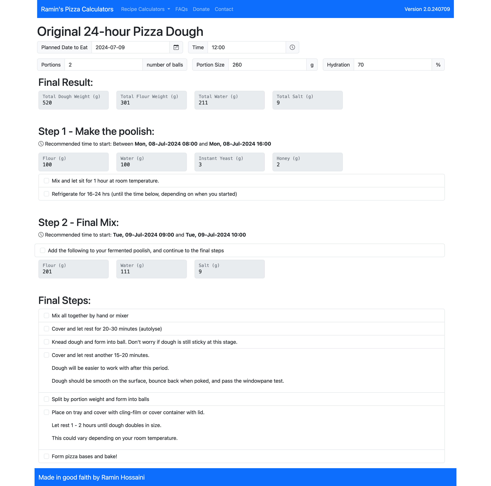

# Ramin's Pizza-dough Calculator
A very simple page that makes the calculations you need to make a pizza. 

Page is built using the Bootstrap framework and JQuery.

# Link to demo:
https://calculators.ramin.io

# Screenshot(s)

# Blog Post
https://www.ramin-hossaini.com/2022/06/poolish-pizza-dough-calculator/

# Contact
Please use the [discussions tab on github](https://github.com/raminhossaini/ramin-dough-calculator/discussions), as your question or feedback may be useful to others as well. You can always contact me using my [contact form](https://www.ramin-hossaini.com/contact/) or on [Discord](https://discord.com/users/87982937961660416)
