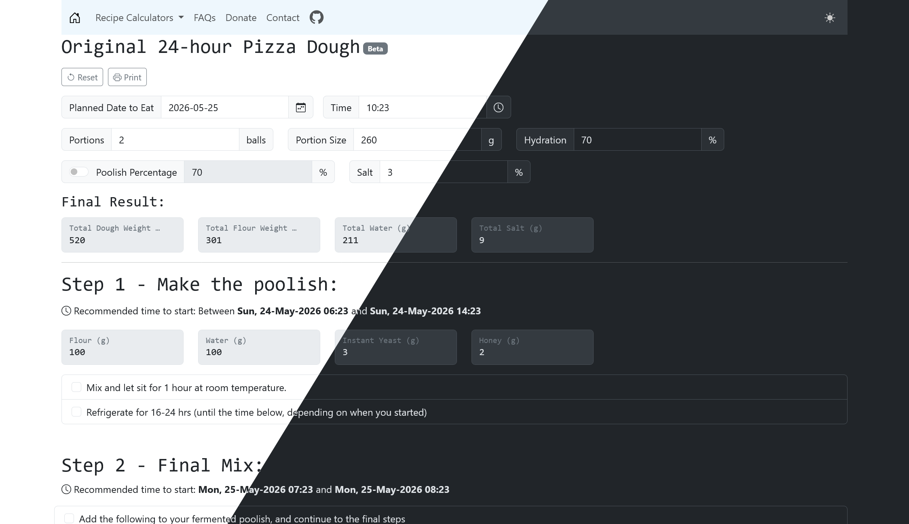

# Ramin's Pizza-dough Calculator

A collection of pizza and bread dough calculators. Pick a recipe, set how many dough balls you want and how big they should be, and the calculator works out the exact gram amounts and a step-by-step, time-based checklist to follow.

**Live demo:** https://calculators.ramin.io

## Calculators

| Calculator | Preferment | Timeline |
| --- | --- | --- |
| Original 24-hour Pizza Dough | Poolish (adjustable percentage) | 24 h |
| Double-fermented 48-hour Pizza Dough | Two-stage poolish | 48 h |
| Original 24-hour Biga Recipe | 100% biga | 24 h |
| Ramin's 48-hour Biga Recipe | 100% biga | 48 h |
| Sourdough Pizza | Sourdough starter | 24–48 h |
| Generic Sourdough Bread | Sourdough starter | — |

Each pizza calculator lets you tune portions, portion size, hydration and salt, and generates a schedule with checkboxes based on your chosen start date and time.

## Build your own recipes

Beyond the built-in calculators, you can create fully custom recipes:

- **Recipe Builder** - define a recipe with [baker's percentages](https://en.wikipedia.org/wiki/Baker_percentage): flour is the 100% base, every other ingredient is a percentage of the flour weight. Add optional step-by-step instructions that become checklists on the recipe page, with a live preview as you build.
- **My Recipes** - your saved recipes, with per-recipe scaling to any number of dough balls.
- **Sharing** - share a recipe with a URL or a QR code. The recipe data is encoded in the link itself, so nothing is uploaded anywhere.
- **Export / Import** - back up all your recipes to a JSON file, or move them to another device or platform.

## Privacy

There is no server-side storage, no database and no account. Custom recipes and your last-used inputs live entirely in your browser's local storage.

## Other features

- Dark mode (follows your preference, with a manual toggle)
- Inputs are remembered between visits, per calculator
- Responsive layout, works well on phones in the kitchen

## Built with

Plain PHP pages, [Bootstrap 5](https://getbootstrap.com/) and jQuery — no build step required.

## Screenshot(s)

## Blog Post

https://www.ramin-hossaini.com/2022/06/poolish-pizza-dough-calculator/

## Contact

Please use the [discussions tab on GitHub](https://github.com/raminhossaini/ramin-dough-calculator/discussions), as your question or feedback may be useful to others as well. You can always contact me using my [contact form](https://www.ramin-hossaini.com/contact/) or on [Discord](https://discord.com/users/87982937961660416)
